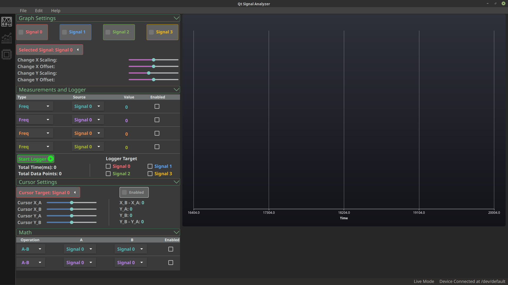

# Qt Signal Analyzer

Device Firmware and Qt front-end code for a basic signal analyzer

Progress as of 12/29/2018

## Credits

Attributes for icons that I borrowed:

- Down Arrow: Icon made by [Lucy G](https://www.flaticon.com/authors/lucy-g) from www.flaticon.com
- Oscilloscope: Icon made by [Freepik](https://www.flaticon.com/authors/freepik) from www.flaticon.com
- Microchip and Analytics: Icon made by [Pixel perfect](https://www.flaticon.com/authors/pixel-perfect) from www.flaticon.com
- Stop button icon: Icon made by [Elegant Themes](https://www.flaticon.com/authors/elegant-themes) from www.flaticon.com
- Play button icon: Icon made by [Those Icons](https://www.flaticon.com/authors/those-icons) from www.flaticon.com

## Features

- Display multiple waveform inputs received from device
- Collect and Analyze waveform statistics
- Manual and Dynamic scaling
- Control device sampling mode
- Saving and Loading data and graphs
- Allow selection of multiple devices
- Maybe some DSP features

## Structure

The repos have two major parts:

- Qt code: Code for the front-end GUI of the analyzer using Qt 5.
- Device code: Device firmware for the TivaC, which will be the one collecting voltage data.

## Qt Code

This project uses Qt 5 and has a mix of QML, Javascrip, and C++, simple logic is generally handled by Javascript but heavy tasks like zero crossing detection for finding waveform frequency is handled by C++.

The application is intended to have 3 tabs, selectable by the icons on the left side bar:

- Live Mode: Which streams data from the MCU and display it and allows other things like adjusting cursors, recording data, etc.
- Analysis Mode: intended for more detailed analysis like FFT of the graph and things like that.
- Device Config Mode: This allows configuration and getting info from the MCU to fine tune sampling configuration.

Aside from the main tabs, there are also the top bar, which allows user to save graph pictures and data, help page and documentation, and other miscellaneous features.

There is also the bottom bar, which serves to report the result of user action(such as whether the data logger was started succesfully), show the current mode, and report the MCU being sampled.

### Live Mode

Live mode has these main components:

- Graph Control: Allow changing scaling and offset of X/Y axis, renaming graph, and changing their on/off status.
- Measurement and Logger: Allow measuring frequency, period, max, min, peak-to-peak of waveform, frequency and period uses zero-crossing detection and would probably be optimized in the future. The logger allows selecting which targets to log and report total time and points since the start of logging.
- Cursor Settings: Control the X/Y axis cursor, it reports the difference in X as well the specific position and difference in Y.
- Math: Draw additional waveform with sources being the signal currently recorded as arguments, currently allows, subtraction, sum, abs and log.

All components are organized as drop-down menu for convenience and except for the cursor one(cursor uses Javascript as its logic handler), has its own thread in order to minimize data processing time. When user interacts, QML will usually invoke a C++ function to update the data structure describing the states, and at certain frequency, the measurements or graph is redrawn to reflect the current options and data. The rate of refresh is being optimized to potentially make it < 100 ms.