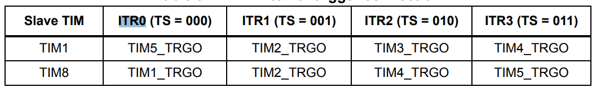
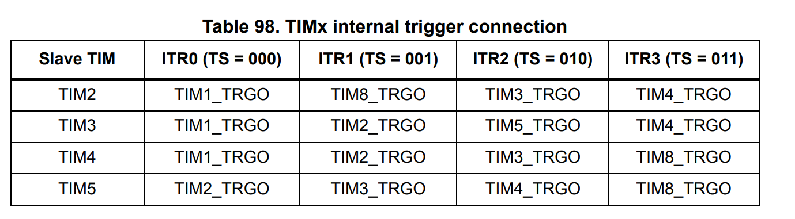

# Signal Analyzer Firmware

STM32F407VG firmware for the signal analyzer

## How to build

To build, you need ```stm32cubemx```, use ```cube_generated/cube_generated.ioc``` as the base project and adjust the output path to be ```cube_generated```

NOTE: Delete the makefile inside ```cube_generated``` before generating code

The following settings should be enabled on cubemx before generating the code:

- Do not generate main function

After code generation, run ```build_and_flash.sh``` to build firmware and flash it

## Viewing CDC USB

Do ```pkill -STOP ModemManager``` at boot, then just ```cat /dev/ttyACM1``` or similar port

## USB PHY HS

The USB3300 HS PHY is used

NOTE: the 3V and 5V pins of the USB3300 need to be connected to the dev board 3V and 5V supply, also connect USB3300 RST to GND

## ADC Allocation

The stm32 has 3 ADC and a total of 8 available ADC pins(the others were mostly taken by USB HS), to offer 4 sampling channels

## Timing Calculations



