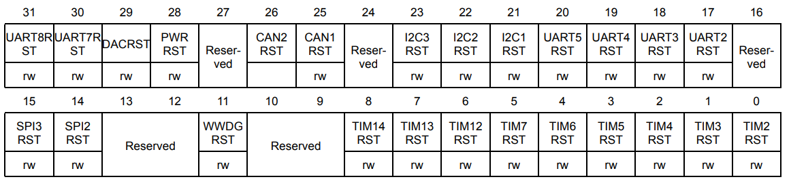
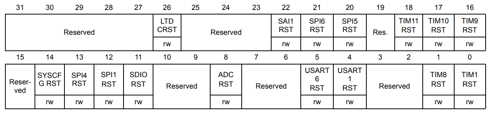

# Signal Analyzer Firmware

STM32F407VG firmware for the signal analyzer. The project uses STMCube to generate base device code. Some CMake magic was added so that the generated Makefile works with CMake

## How to build

To build, you need ```stm32cubemx```, use ```cube_generated/cube_generated.ioc``` as the base project and adjust the output path to be ```cube_generated```

NOTE: Delete the makefile inside ```cube_generated``` before re-generating code

The following settings should be enabled on cubemx before generating the code:

- Do not generate main function

After code generation, run ```build_and_flash.sh``` to build firmware and flash it

## Overall Design

The firmware tries to maximize the amount of data collected by utilizing as much built-in hardware as possible. User defined interrupt handlers are usually not used unless absolutely necessary. DMA is utilized thoroughly to reduce CPU load

The system utilizes 3 timers and 3 ADCs as well as both DMA controllers

Timer 3 is the sampling timer, at each overflow it triggers the ADC and timestamp timer to add a sample to buffer using DMA. The way it triggers other components vary, Timer 3 configures its channel 1 as a PWM generator that generates a pulse when the timer overflows as well as having the overflow trigger signal being an update signal

Timer 2 is the timestamp timer, every sample uses this timer as a timestamp provider, its channel 1 was configured to be input channel that listens to channel 1 of the sampling timer and move its current timer value to the current buffer using DMA

The ADCs listen to sampling timer trigger update signal and start sampling and do ADC movement when done

Timer 4 is the buffer swap timer. After a fixed number of samples, the current buffer is swapped out for a new one and the old buffer will be read by the USB subsystem for data transport. Buffer swap timer counts the number of samples by counting the amount of time the sampling timer overflows. After a certain amount of overflows, buffer swap timer itself overflow and trigger an ISR that swap to the next buffer in the Circular Buffer

### USB

Due to the required data rate (10 MByte/s) an external HS PHY(USB3300) is used as the built-in PHY only supports FS. The USB CDC interface is used and raw struct of fixed size is streamed over the wire

NOTE: the 3V and 5V pins of the USB3300 need to be connected to the dev board 3V and 5V supply, also connect USB3300 RST to GND

To view CDC USB:

Do ```pkill -STOP ModemManager``` at boot, then just ```cat /dev/ttyACM1``` or similar port

### ADC

The stm32 has 3 ADC and a total of 8 available ADC pins(the others were mostly taken by USB HS). ADC0 and ADC1 each sample one channel, these channels have 12-bit resolution. ADC2 sample two channels and have 8-bit resolution. The total sampling time for each adc module is roughly the same.

## Helpful Pics from Datasheet




